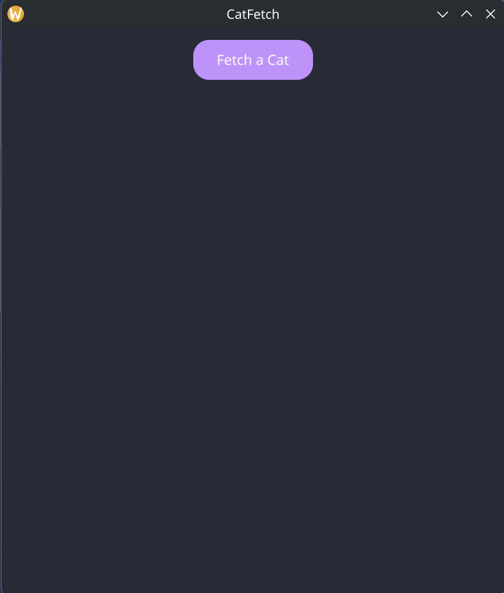
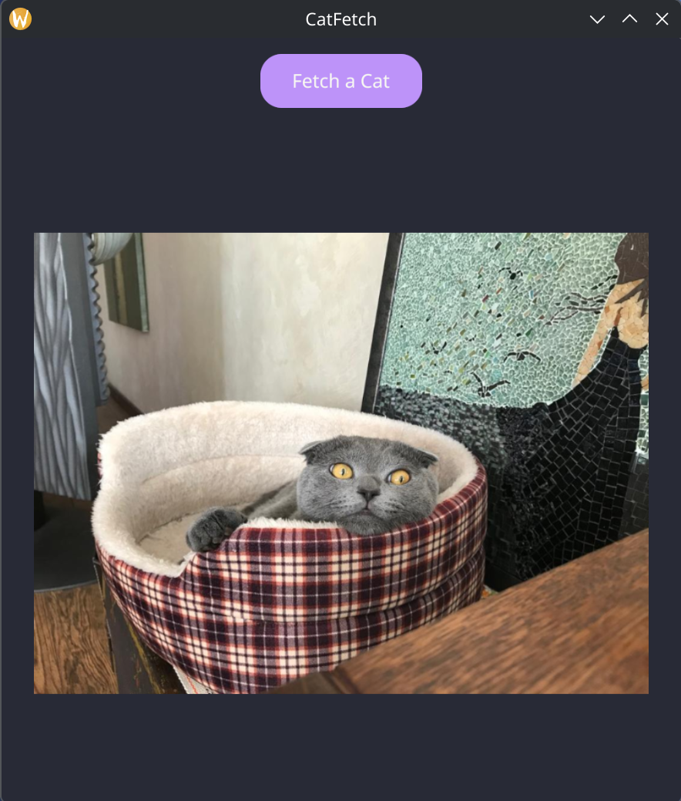

# CatFetch

[](https://go.dev/)
[](https://github.com/bmj2728/catfetch/actions/workflows/test.yml)
[](https://github.com/bmj2728/catfetch/actions/workflows/release.yml)
[](https://codecov.io/gh/bmj2728/catfetch)

A desktop GUI application built with Go and Gio UI that fetches and displays random cat images from [cataas.com](https://cataas.com/).

## Gallery

<p align="center">
  
  
</p>

## Installation

### Windows

1. Download the latest release for Windows:
   - Go to [Releases](https://github.com/bmj2728/catfetch/releases/latest)
   - Download `catfetch_vX.X.X_windows_amd64.zip`

2. Extract the ZIP file to a location of your choice

3. Run `catfetch-windows-amd64.exe`

**Optional:** Add the extracted folder to your PATH to run from anywhere.

### macOS

1. Download the latest release for macOS:
   - Go to [Releases](https://github.com/bmj2728/catfetch/releases/latest)
   - Download `catfetch_vX.X.X_macos_universal.zip` (supports both Intel and Apple Silicon)

2. Extract the ZIP file

3. Double-click `catfetch.app` to launch

**Note:** On first launch, macOS may warn that the app is from an unidentified developer. Right-click the app and select "Open" to bypass this warning.

### Linux

#### Download Pre-built Binary

1. Download the latest release for Linux:
   - Go to [Releases](https://github.com/bmj2728/catfetch/releases/latest)
   - Download `catfetch_vX.X.X_linux_amd64.tar.gz`

2. Extract and run:
   ```bash
   tar -xzf catfetch_vX.X.X_linux_amd64.tar.gz
   ./catfetch-linux-amd64
   ```

#### Install System-wide (Linux)

**User-local install:**
```bash
cp catfetch-linux-amd64 ~/bin/catfetch
chmod +x ~/bin/catfetch
# Ensure ~/bin is in your PATH
```

**System-wide install:**
```bash
sudo cp catfetch-linux-amd64 /usr/local/bin/catfetch
sudo chmod +x /usr/local/bin/catfetch
```

Then run from anywhere:
```bash
catfetch
```

## Usage

Launch the application and click the "Fetch Image" button to load a random cat picture. The image will automatically scale to fit the window while maintaining its aspect ratio.

## Building from Source

### Prerequisites

- Go 1.25 or higher
- Platform-specific dependencies:
  - **Linux:** `libwayland-dev`, `libx11-dev`, `libxkbcommon-x11-dev`, `libgles2-mesa-dev`, `libegl1-mesa-dev`, `libffi-dev`, `libxcursor-dev`, `libvulkan-dev`
  - **macOS:** Xcode command line tools
  - **Windows:** MinGW-w64 or similar CGO-compatible compiler

### Build Instructions

```bash
# Clone the repository
git clone https://github.com/bmj2728/catfetch.git
cd catfetch

# Build the application
go build -o build/catfetch ./cmd/catfetch

# Run it
./build/catfetch
```

Or run directly without building:
```bash
go run ./cmd/catfetch/main.go
```

### Running Tests

```bash
# Run all tests
go test ./...

# Run with coverage
go test -v -race -coverprofile=coverage.out -covermode=atomic ./...

# View coverage report
go tool cover -html=coverage.out
```

## Roadmap

- **Cat History**: Browse previously fetched cat images
- **Text Overlays**: Add custom text overlays to cat images
- **Tag Search**: Search for cats by specific tags
- **Image Filters**: Add sliders and options to apply filters (sepia, blur, brightness, etc.) using cataas API parameters

## License

MIT License - see [LICENSE](LICENSE) file for details.

Copyright (c) 2026 NovelGit LLC
